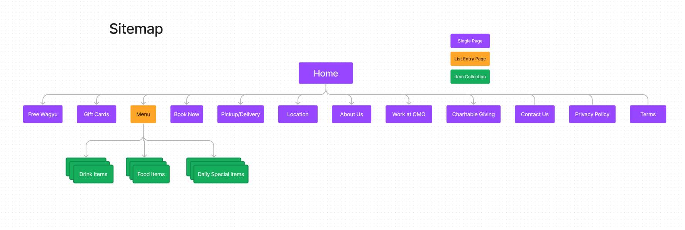
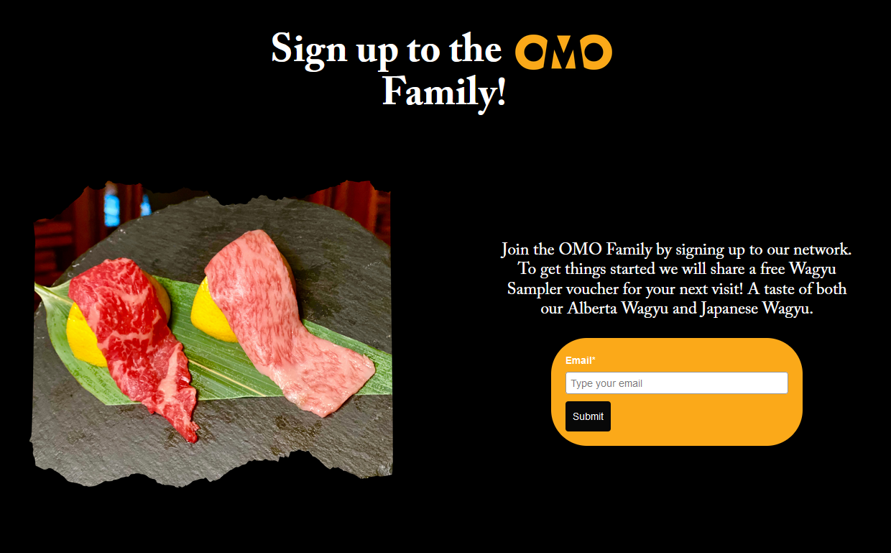
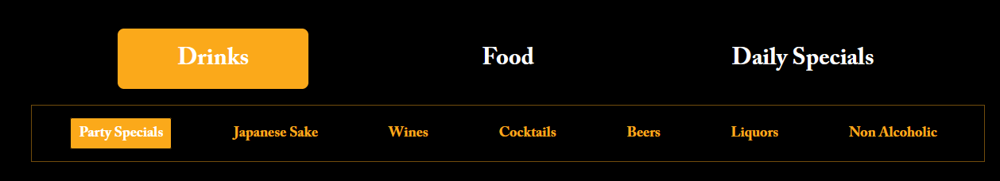
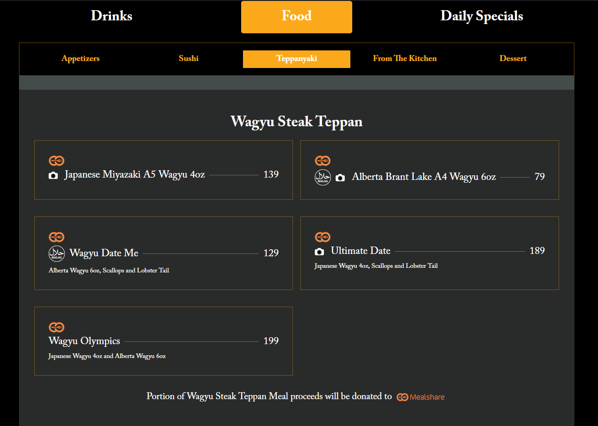
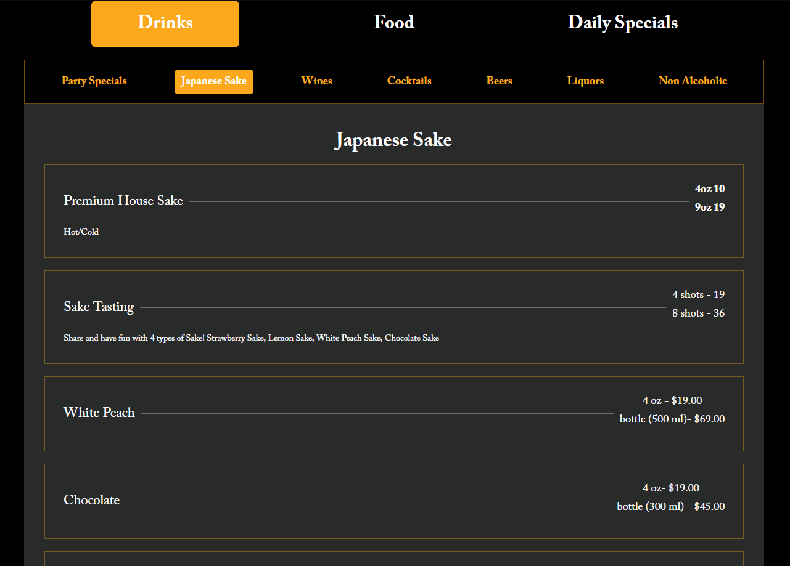
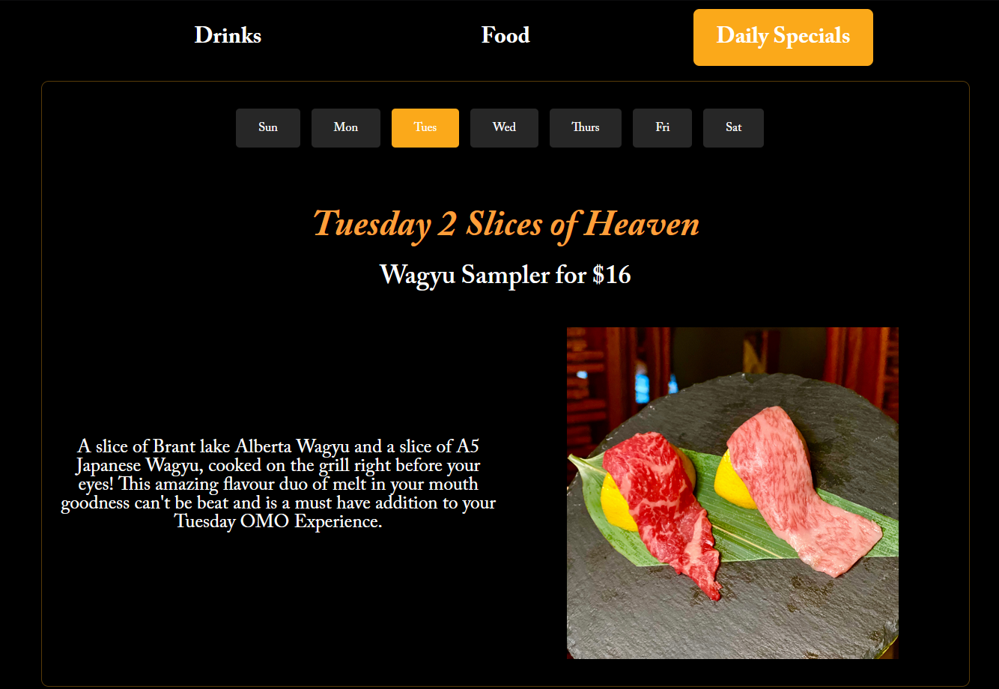
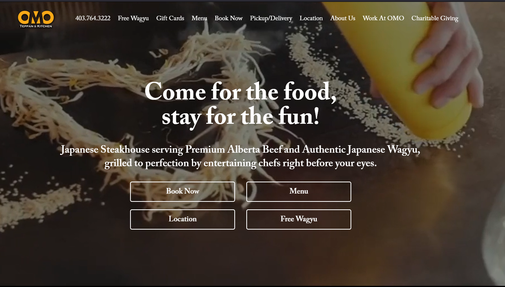

# Restaurant Website Profile - OMO Teppan & Kitchen

## Summary
OMO Teppan & Kitchen is Japanese restaurant that is in the food industry. Their website can be accessed from [this link](https://www.omoyyc.com/).

This place targets people who are interested in Japanese culture and food:
- For cultural aspect, restaurant has several cultural objects such as paintings and lanterns inside store to make store feel like its in Japan.
- For food aspect, restaurant has world renowned Japanese Wagyu Beef which most people want to try at least once in their life.

Restaurant also does live cooking show for its customers that will be another authentic experience.

Restaurant has wide variety for foods and drinks. Food categories includes appetizers, sushi and teppanyaki. Drink categories includes Japanese sake, wine, cocktails, beers and non-alcoholic.

Restaurant have many japanese food that can be eaten according to customers' need. They have gluten-free, vegetarian and halal types for different foods which will widen the restaurant's auidence.

## Sitemap

## Single Types
- Home Page
    - Fields:
        - Content: Rich Text
        - Image: Media - image
        - Video: Media - video
- Free Wagyu
    
    - Fields:
        - Title: Small Text
        - Description: Long Text
        - Email: Email
- Gift Cards
    - Fields:
        - Title: Small Text
        - Description: Long Text
        - Amount: Number(decimal)
- Menu
    
    - Fields:
        - Type: Enumeration
- Book Now (opens external link)
- Pickup/Delivery
    - Fields:
        - Title: Small Text
        - Image: Media - image
        - External link: Small text(clickable on image)
            - Could not be text at all?
- Location
    - Fields:
        - Description: Long Text
        - Address: Small Text
        - Hours: Small Text
        - Map: Custom Field(for plugin)
            - Could be media or something else?
- About Us
    - Fields:
        - Title: Small Text
        - Body: Rich Text
        - Image: Media - image
- Work At OMO
    - Fields:
        - Title: Small Text
        - Content: Long Text
            - Could be Rich Text as well but it doesn't have any italic or bold.
        - Form Fields
- Charitable Giving
    - Fields:
        - Title: Small Text
        - Image: Media - image
        - Description: Long Text
        - Form Fields
- Contact Us
    - Fields:
        - Title: Small Text
        - Phone: Number
        - Email: Email
        - Address: Small Text
        - Hours: Small Text
- Privay Policy
    - Fields:
         - Body: Rich Text
- Terms  
    - Fields:
         - Body: Rich Text

## Collection Types
- Food Menu Items
    
    - Fields:
        - Category: Relation(with type of food) - one-to-many
        - Type: Enumeration
        - Dish Name: Small Text
        - Price: Number(decimal)
        - Description: Long Text
        - Image: Media - image
        - Gluten Free: Boolean
        - Vegetarian: Boolean
        - Halal: Boolean
- Drink Menu Items
    
    - Fields:
        - Category: Relation(with type of drink) - one-to-many
        - Type: Enumeration
        - Drink Name: Small Text
        - Amount: Number(decimal)
        - Price: Number(decimal)
        - Description: Long Text
        - Gluten Free: Boolean
- Daily Specials Items
    
    - Fields:
        - Days: Enumeration
        - Dish Name & Price: Small Text
        - Body: Rich Text
        - Image: Media - image
## Critique
Restaurant's website is structured relatively good. Especially menu page divided into food and drink categories that makes it easy to navigate. Inside the specific food or drink page, page also has sub-categories that divides foods into detailed categories that makes it easy to find the food you want.

On the other hand, navigation bar has way too many buttons which overwhelms the user and makes it harder to access to menu or location of restaurant. Also on hero section of homa page, they put 4 buttons which are accessible from top navigation. It would have been better if they only put booking button and menu. Lastly, they should include image for every menu item so that customer can see what dishes or drinks look like before ordering.

This restaurant differs from its competition by doing some procedures differently:
- They try their best to replicate the authentic Japanese Steakhouse by placing local items from Japan including serving authentic Japanese wagyu beef.
- Chefs are not only preparing delicious dishes but also entertain the people during the cooking process that makes it fun during wait.